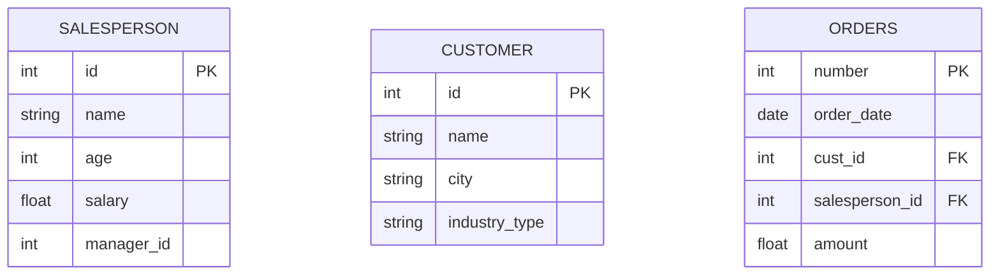

# Tables

## ERD

## Data Preview

| id | name          | age | salary  | manager_id |
|----|---------------|-----|---------|------------|
| 1  | Alice Smith   | 30  | 60000   | 3          |
| 2  | Bob Johnson    | 45  | 75000   | 3          |
| 3  | Carol White   | 38  | 80000   | NULL       |
| 4  | David Brown   | 28  | 55000   | 3          |
| 5  | Eva Green     | 35  | 72000   | 2          |

## Customer Table

| id | name          | city       | industry type   |
|----|---------------|------------|------------------|
| 1  | Global Corp   | New York   | Technology        |
| 2  | Eco Solutions  | San Francisco | Environmental     |
| 3  | Foodie Co.    | Chicago    | Food & Beverage   |
| 4  | FinTech Inc.  | Boston     | Finance           |
| 5  | HealthPlus    | Seattle    | Healthcare        |

## Orders Table

| number | order_date | cust_id | salesperson_id | amount  |
|--------|------------|---------|----------------|---------|
| 101    | 2024-01-15 | 1       | 1              | 15000   |
| 102    | 2024-02-20 | 2       | 2              | 20000   |
| 103    | 2024-03-05 | 3       | 1              | 10000   |
| 104    | 2024-03-15 | 4       | 3              | 25000   |
| 105    | 2024-04-01 | 5       | 5              | 30000   |

